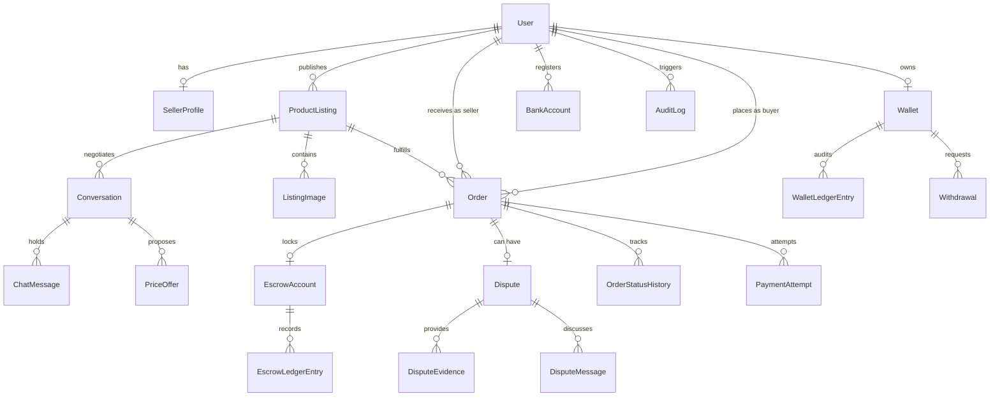

# NgeBekasinYuk Data Model & Persistence Specification

## 1. Relational Database & Migration Strategy

All domain state is persisted using PostgreSQL 16+ via Prisma ORM with normalized relations, strict foreign key constraints, unique public identifiers, append-only ledgers, and targeted performance indexes.

### 1.1 Migration Architecture
- **Schema Location**: `apps/web/prisma/schema.prisma` (`datasource db { provider = "postgresql" }`)
- **Migration Directory**: `apps/web/prisma/migrations/`
- **Development Workflow**: `pnpm --filter web exec prisma migrate dev`
- **Production CI / Deployment**: `pnpm --filter web exec prisma migrate deploy`
- Zero reliance on `prisma db push` in production. Every schema alteration is version-controlled as an SQL migration file.

---

## 2. Entity-Relationship Diagram (Logical)

---

## 3. Core Models & Field Invariants

### 3.1 `User`
- `id`: String (CUID, primary key)
- `email`: String (Unique, Indexed)
- `role`: "BUYER" | "SELLER" | "ADMIN"
- `sessionVersion`: Int (Default 1, used for server-side session revocation)
- `hashedPassword`: String (Bcrypt, cost 10)
- `hashedPin`: String? (Bcrypt, 6-digit transaction PIN)
- `pinFailedAttempts`: Int (Default 0)
- `pinLockedUntil`: DateTime? (Null if active, timestamp if locked)
- `totpSecret`: String? (Per-admin base32 secret for RFC 6238 2FA step-up)
- `isVerified`: Boolean (KYC status)

### 3.2 `Order`
- `orderNumber`: String (Unique, e.g. `ORD-2026-8D71X2`)
- `buyerId`: String (Indexed)
- `sellerId`: String (Indexed)
- `status`: Enum (Indexed: `PENDING_PAYMENT`, `FUNDED`, `PROCESSING`, `SHIPPED`, `DELIVERED`, `INSPECTING`, `COMPLETED`, `DISPUTED`, `RESOLVED_BUYER`, `RESOLVED_SELLER`, `REFUNDED`, `CANCELLED`)
- `itemPrice`: Int (Safe integer IDR)
- `shippingFee`: Int (Safe integer IDR)
- `escrowFee`: Int (Safe integer IDR)
- `totalAmount`: Int (Safe integer IDR)
- `inspectionStartedAt`: DateTime?
- `inspectionExpiresAt`: DateTime? (2x24-hour buyer inspection window)

### 3.3 `EscrowAccount` & `EscrowLedgerEntry`
- `EscrowAccount.amount`: Int (Canonical funded value)
- `EscrowAccount.status`: `PENDING` | `HELD` | `RELEASED` | `REFUNDED` | `FROZEN_DISPUTE`
- `EscrowAccount.isReleased`: Boolean (Guarded by atomic conditional database updates)
- `EscrowAccount.isRefunded`: Boolean (Guarded by atomic conditional database updates)
- `EscrowAccount.idempotencyKey`: String (Unique)
- `EscrowLedgerEntry`:
  - `escrowAccountId`: String (Indexed)
  - `type`: `DEPOSIT` | `HOLD` | `RELEASE_SELLER` | `REFUND_BUYER`
  - `direction`: `CREDIT` | `DEBIT`
  - `amount`: Int
  - `previousBalance`: Int
  - `newBalance`: Int
  - `idempotencyKey`: String (Unique constraint prevents duplicate entries)

### 3.4 `Wallet` & `WalletLedgerEntry`
- `activeBalance`: Int (Derived from ledger / updated conditionally)
- `heldBalance`: Int (Escrow funds in transit or inspection)
- `WalletLedgerEntry`:
  - `walletId`: String (Indexed)
  - `type`: `ESCROW_RELEASE` | `WITHDRAWAL` | `REFUND`
  - `direction`: `CREDIT` | `DEBIT`
  - `amount`: Int
  - `balanceAfter`: Int
  - `idempotencyKey`: String (Unique)

### 3.5 `Dispute`
- `disputeNumber`: String (Unique, e.g. `DSP-2026-0042`)
- `status`: Enum (Indexed: `OPEN` | `AWAITING_SELLER` | `UNDER_REVIEW` | `INVESTIGATING` | `RESOLVED_BUYER` | `RESOLVED_SELLER` | `CLOSED`)
- `verdict`: `REFUND_BUYER` | `RELEASE_SELLER`
- `decidedByAdminId`: String? (Admin user ID)
- `decidedAt`: DateTime?

---

## 4. Performance & Query Indexing Matrix

The following strategic indexes are defined in `apps/web/prisma/schema.prisma` to ensure high-throughput query performance and eliminate full-table scans under production load:

| Model | Indexed Fields | Query Rationale |
|---|---|---|
| `Order` | `buyerId` | Fast retrieval of buyer order history (`/orders`) |
| `Order` | `sellerId` | Fast retrieval of seller incoming orders (`/my-listings`) |
| `Order` | `status` | State machine worker scans and dashboard filtering |
| `ProductListing` | `sellerId` | Seller inventory management and catalog lookup |
| `ProductListing` | `status` | Marketplace catalog filtering (`status: ACTIVE`) |
| `PaymentAttempt` | `orderId` | Webhook settlement lookup by order identifier |
| `Dispute` | `status` | Admin dispute mediation queue filtering (`/admin/disputes`) |
| `Notification` | `userId` | Real-time user notification feed rendering |
| `WalletLedgerEntry` | `walletId` | Transaction history ledger pagination (`/wallet`) |
| `EscrowLedgerEntry` | `escrowAccountId` | Escrow account ledger reconciliation queries |
| `AuditLog` | `userId` | User activity forensic audit trails |
| `AuditLog` | `createdAt` | Time-series forensic analysis and log export |
| `OrderStatusHistory` | `orderId` | Order lifecycle progress timeline rendering |
