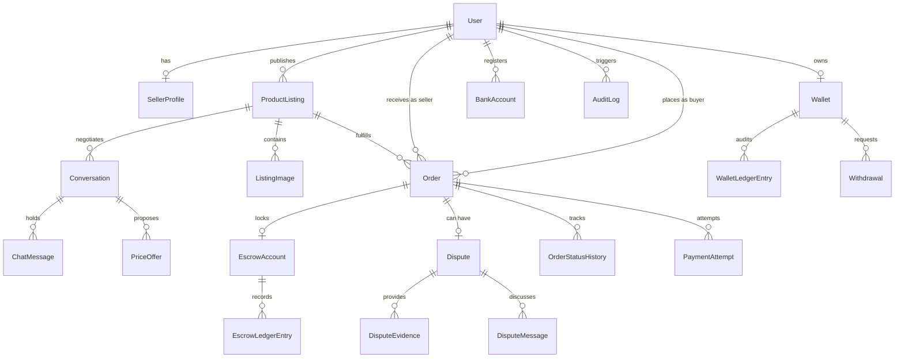

# NgeBekasinYuk Data Model & Persistence Specification

## 1. Relational Database Overview

All sensitive domain state is modeled using Prisma ORM with normalized relations, foreign key constraints, unique public identifiers, and append-only ledgers.

Local development runs zero-dependency SQLite (`apps/web/dev.db`), while production configurations run PostgreSQL via the identical relational schema.

---

## 2. Entity-Relationship Diagram (Logical)

---

## 3. Core Models & Constraints

### 3.1 `User`
- `id`: String (CUID)
- `email`: String (Unique, Indexed)
- `role`: "BUYER" | "SELLER" | "ADMIN"
- `hashedPassword`: String (Bcrypt, cost 10)
- `hashedPin`: String? (Bcrypt, 6-digit transaction PIN)
- `pinFailedAttempts`: Int (Default 0)
- `pinLockedUntil`: DateTime? (Null if active, timestamp if locked)
- `isVerified`: Boolean (KYC status)

### 3.2 `Order`
- `orderNumber`: String (Unique, e.g. `ORD-2026-8D71X2`)
- `status`: Enum (`PENDING_PAYMENT`, `FUNDED`, `PROCESSING`, `SHIPPED`, `DELIVERED`, `INSPECTING`, `COMPLETED`, `DISPUTED`, `RESOLVED_BUYER`, `RESOLVED_SELLER`, `REFUNDED`, `CANCELLED`)
- `itemPrice`: Int (Safe integer IDR)
- `shippingFee`: Int (Safe integer IDR)
- `escrowFee`: Int (Safe integer IDR)
- `totalAmount`: Int (Safe integer IDR)
- `inspectionStartedAt`: DateTime?
- `inspectionExpiresAt`: DateTime? (2x24 hours)

### 3.3 `EscrowAccount` & `EscrowLedgerEntry`
- Invariant: Double-entry financial auditability.
- `EscrowAccount.amount`: Int (Canonical funded value)
- `EscrowAccount.status`: `PENDING` | `HELD` | `RELEASED` | `REFUNDED` | `FROZEN_DISPUTE`
- `EscrowAccount.isReleased`: Boolean
- `EscrowAccount.isRefunded`: Boolean
- `EscrowAccount.idempotencyKey`: String (Unique)
- `EscrowLedgerEntry`:
  - `type`: `DEPOSIT` | `HOLD` | `RELEASE_SELLER` | `REFUND_BUYER`
  - `direction`: `CREDIT` | `DEBIT`
  - `amount`: Int
  - `previousBalance`: Int
  - `newBalance`: Int
  - `idempotencyKey`: String (Unique constraint prevents double writes)

### 3.4 `Wallet` & `WalletLedgerEntry`
- `activeBalance`: Int (Derived from ledger / updated atomically)
- `heldBalance`: Int (Escrow funds in transit or inspection)
- `WalletLedgerEntry`:
  - `type`: `ESCROW_RELEASE` | `WITHDRAWAL` | `REFUND`
  - `direction`: `CREDIT` | `DEBIT`
  - `amount`: Int
  - `balanceAfter`: Int
  - `idempotencyKey`: String (Unique)

### 3.5 `Dispute`
- `disputeNumber`: String (Unique, e.g. `DSP-2026-0042`)
- `status`: `OPEN` | `AWAITING_SELLER` | `UNDER_REVIEW` | `INVESTIGATING` | `RESOLVED_BUYER` | `RESOLVED_SELLER` | `CLOSED`
- `verdict`: `REFUND_BUYER` | `RELEASE_SELLER`
- `decidedByAdminId`: String? (Admin user ID)
- `decidedAt`: DateTime?
