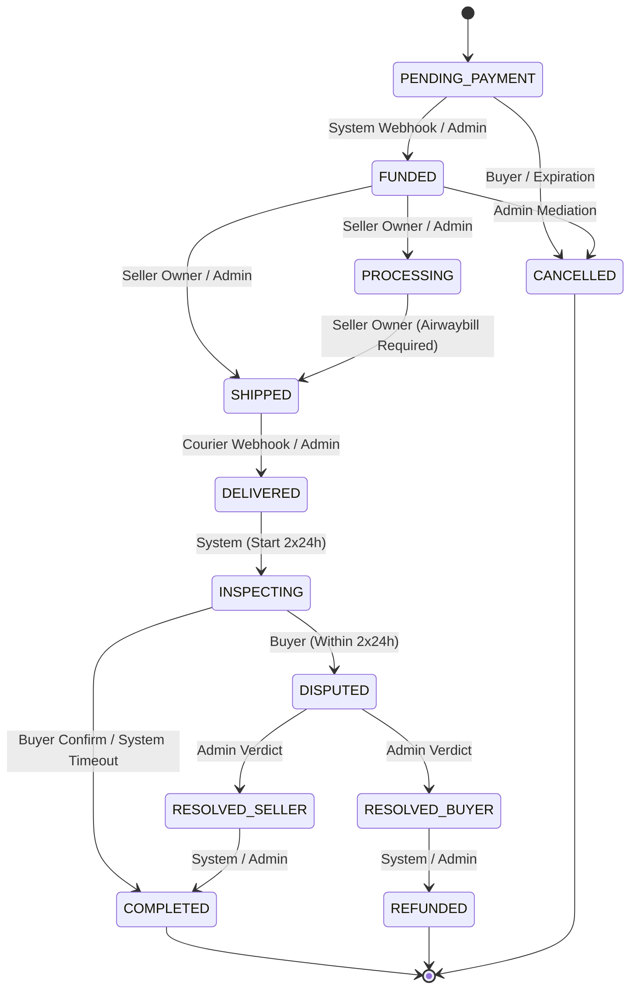

# NgeBekasinYuk Order State Machine Specification

## 1. Formal Order Lifecycle

---

## 2. State Transition Matrix & Actor Permissions

| From Status | To Status | Allowed Actor | Conditions & Business Invariants |
|---|---|---|---|
| `PENDING_PAYMENT` | `FUNDED` | `SYSTEM`, `ADMIN` | Valid payment attempt amount matches total order amount. Escrow account created with status `HELD`. |
| `PENDING_PAYMENT` | `CANCELLED` | `BUYER` (Owner), `SYSTEM` | Unpaid order cancelled by buyer or 2-hour payment window expired. |
| `FUNDED` | `PROCESSING` | `SELLER` (Owner), `ADMIN` | Seller begins packing device. |
| `FUNDED` | `SHIPPED` | `SELLER` (Owner), `ADMIN` | Airwaybill (nomor resi) and courier service recorded. |
| `PROCESSING` | `SHIPPED` | `SELLER` (Owner), `ADMIN` | Same as above. |
| `SHIPPED` | `DELIVERED` | `SYSTEM`, `ADMIN` | Courier tracking webhook reports package delivered. |
| `DELIVERED` | `INSPECTING` | `SYSTEM`, `ADMIN` | Sets `inspectionStartedAt = now` and `inspectionExpiresAt = now + 48h`. |
| `INSPECTING` | `COMPLETED` | `BUYER` (Owner), `SYSTEM` (Timeout) | Buyer confirms unit matches description, OR 2x24-hour inspection expires automatically without dispute. Triggers idempotent `EscrowLedgerService.releaseEscrow()`. |
| `INSPECTING` | `DISPUTED` | `BUYER` (Owner) | Opened before `inspectionExpiresAt`. Freezes escrow account status to `FROZEN_DISPUTE`. |
| `DISPUTED` | `RESOLVED_BUYER` | `ADMIN` Only | Requires step-up admin 2FA verification. Prepares 100% refund. |
| `DISPUTED` | `RESOLVED_SELLER` | `ADMIN` Only | Requires step-up admin 2FA verification. Prepares escrow payout to seller. |
| `RESOLVED_BUYER` | `REFUNDED` | `SYSTEM`, `ADMIN` | Executes atomic `EscrowLedgerService.refundEscrow()`. Terminal state. |
| `RESOLVED_SELLER` | `COMPLETED` | `SYSTEM`, `ADMIN` | Executes atomic `EscrowLedgerService.releaseEscrow()`. Terminal state. |

---

## 3. Terminal State Invariants

Orders in terminal states (`COMPLETED`, `REFUNDED`, `CANCELLED`) are immutable with respect to further state transitions. Any attempt to transition out of a terminal state throws `OrderStateTransitionError("INVALID_ORDER_TRANSITION")`.
